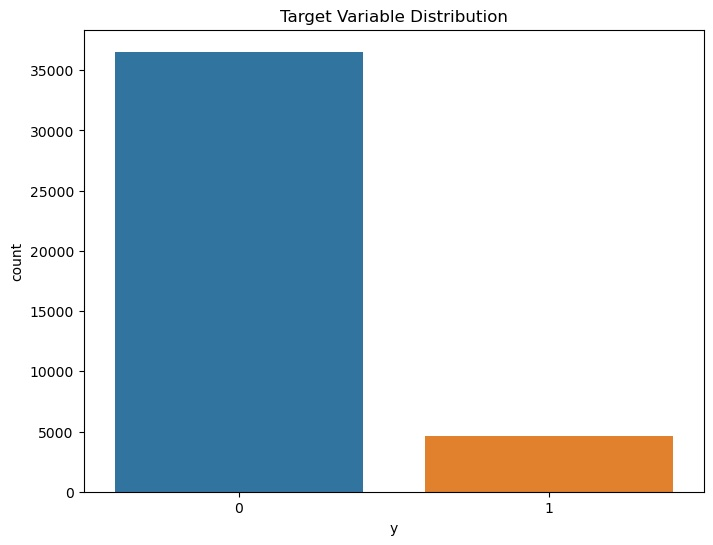
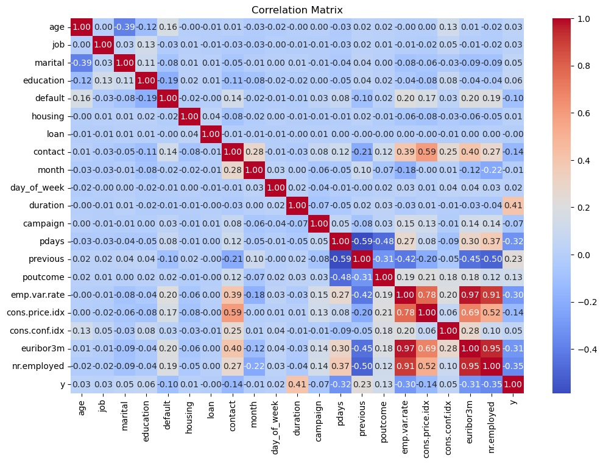
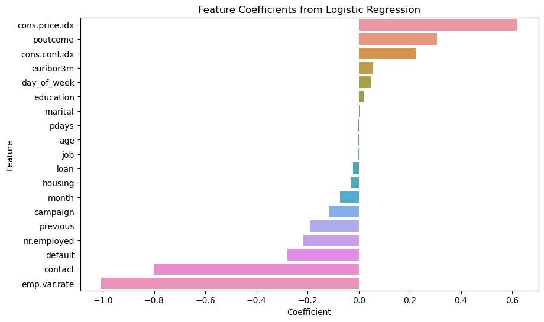

# papp3

## Problem Statement:
Will the client subscribe to a term deposit?

The goal of this project is to build and evaluate predictive models to determine the success of a bank marketing campaign. The goal is to predict whether a client will subscribe to a term deposit based on various attributes.

## Solution submission:
prompt_III.ipynb - Contains the solution sumbission

## Outcomes/Prediction
We are trying to predict if the client will subsribe to a term deposit and important factors influencing the decision.

Features used for prediciton in this dataset:
**categorical_features** = job, marital, education, default, housing, loan, contact, month, day_of_week, poutcome
**numerical_features** = age, duration, campaign, pdays, previous, emp.var.rate, cons.price.idx, cons.conf.idx, euribor3m, nr.employed
**Target Feature:** 'y' - has the client subscribed a term deposit? (binary: 'yes','no')

### Data Acquisition
Provided `bank-additional-full.csv` data has **52944** and total of 21 columns.

### Missing Data:
As first step the data was analyzed for missing values and nans. 
No missing data was found.

## Data Preparation:

 - Duplicate records were removed to ensure data quality.
 - 'duration' column was removed for better predictive model
 - Encoded categorical features using label encoding.
 - Transformed numerical features using standard scaler

## Data Visualization:

#### Distribution of target variable
We can observe the target variable is not balanced, there are significantly less clients who subscribed to term deposits

#### Correlation matrix
- Target variable y is highly correlated to the call duration
- Features like nr.employed, euribor3m, pdays are negatively correlated to target varable y

## Analysis and Modeling

- Exploratory Data Analysis (EDA): Analyzed the dataset to understand data distributions, correlations, and relationships between features.

- Machine Learning Models: 

   - Following machine learning models were trained and evaluated:
     - **Baseline Model**: A dummy classifier was used to establish a baseline performance.
     - **Logistic Regression**
     - **K-Nearest Neighbors (KNN)**
     - **Support Vector Machine (SVM)**
     - **Decision Tree**

## Model Evaluation: 
 Evaluated model performance using training time, training and test accuracy

- **Baseline results using defaults for models Logistic Regression, K-Nearest Neighbors, Support Vector Machine, Decision Tree**

                                                Train Time  Train Accuracy  Test Accuracy
                        Logistic Regression       0.334670        0.893018       0.885867
                        K-Nearest Neighbors       0.010570        0.909624       0.876761
                        Support Vector Machine   29.154650        0.888646       0.882103
                        Decision Tree             0.162148        0.992471       0.835236

- **Best model results using hyperparameter tuning Logistic Regression, K-Nearest Neighbors, Support Vector Machine, Decision Tree**

                                                Train Time  Train Accuracy  Test Accuracy
                        Logistic Regression       0.184656        0.892805       0.887081
                        K-Nearest Neighbors       0.006792        0.901943       0.880282
                        Support Vector Machine  150.096207        0.891925       0.885138
                        Decision Tree             0.097408        0.908834       0.885746

## Findings
The logistic regression model, after hyperparameter tuning, showed the best balance between simplicity, interpretability, and performance with an accuracy of 88.7% on test data. This model can help the bank identify clients more likely to subscribe to a term deposit, optimizing their marketing efforts.

- **Feature coefficients from logistic regression having most influence**
  - cons.price.idx: consumer price index 
  - euribor3m: euribor 3 month rate
  - cons.conf.idx: consumer confidence index 

## Next Steps:

To further improve the model:
- Explore more advanced feature engineering techniques.
- Utilize ensemble methods like Random Forest or Gradient Boosting.
- Regularly update the model with new data to maintain its accuracy.